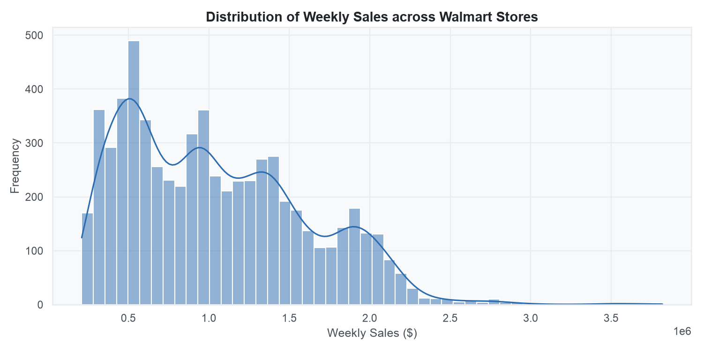
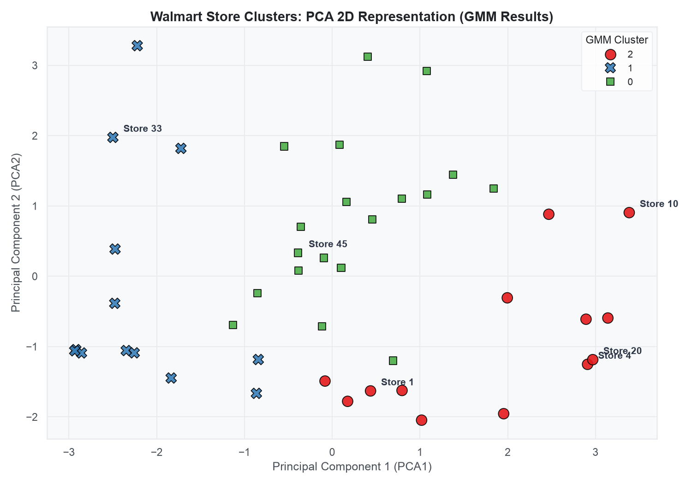
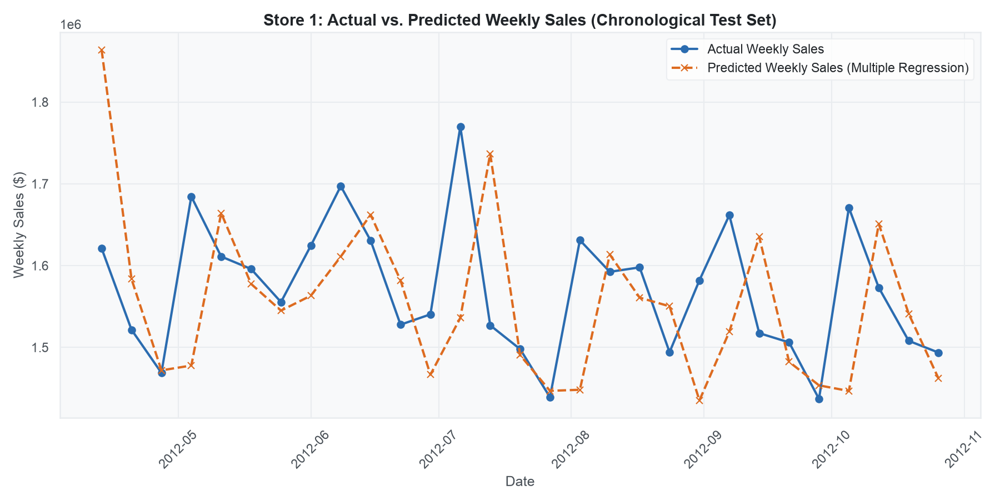
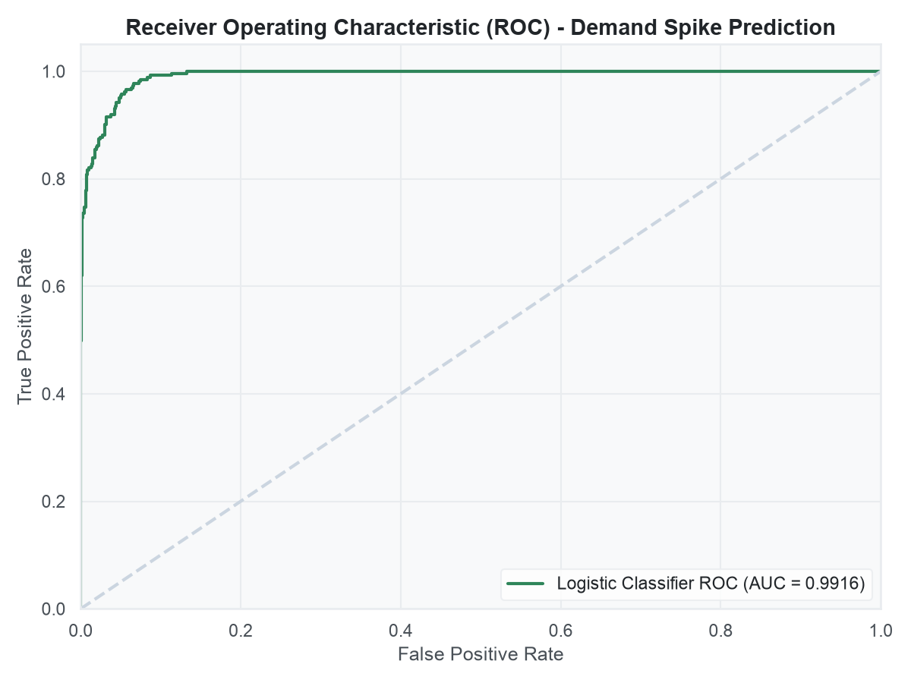

# Smart Retail Inventory Prediction System

This repository features a production-grade machine learning pipeline designed to segment retail store profiles and forecast weekly product demand. By integrating unsupervised clustering (BIRCH and GMM) with supervised regression models (Linear, Multiple, and Logistic), it provides actionable inventory optimization strategies and identifies high-demand spikes to mitigate stockout risks.

---

## 1. Project Directory Structure

The project is structured modularly following production-grade software engineering standards. All paths below are relative to the project root:

```
retail-inventory-prediction-system/
├── requirements.txt           # Python library dependencies (Pandas, Scikit-learn, etc.)
├── .gitignore                 # Tells Git which files to ignore (venv, raw data, etc.)
├── README.md                  # Project documentation and visual walkthrough (This file)
└── src/                       # Production Pipeline Modules
    ├── __init__.py            # Marks folder as a Python package
    ├── utils.py               # Configures logging and clean, premium plot styles
    ├── data_loader.py         # Downloads and caches raw Walmart Sales data from GitHub
    ├── preprocessing.py       # Aggregates store features and engineers lag sales features
    ├── clustering.py          # Standardizes data, runs BIRCH/GMM, and applies PCA
    └─- regression.py          # Trains Simple, Multiple, and Logistic regression models
```

---

## 2. Setup and Execution (Cross-Platform)

Follow these steps to set up the project on your local machine.

### Step 1: Open Terminal
Open your terminal (macOS/Linux) or Command Prompt/PowerShell (Windows) inside the project folder.

### Step 2: Create a Virtual Environment
```bash
# macOS / Linux / Windows
python3 -m venv .venv
# Note: On some Windows setups, you may need to type 'python' instead of 'python3':
# python -m venv .venv
```

### Step 3: Activate the Virtual Environment
Activate the environment depending on your operating system:

*   **macOS / Linux:**
    ```bash
    source .venv/bin/activate
    ```
*   **Windows (Command Prompt):**
    ```cmd
    .venv\Scripts\activate.bat
    ```
*   **Windows (PowerShell):**
    ```powershell
    .venv\Scripts\Activate.ps1
    ```

*(Once activated, your terminal prompt will show `(.venv)` at the beginning).*

### Step 4: Install Dependencies
```bash
pip install -r requirements.txt
```

### Step 5: Open and Run the Jupyter Notebook
1.  Open the project folder in **VS Code** (or run `jupyter notebook` in your terminal).
2.  Double-click the file [retail_inventory_system.ipynb](retail_inventory_system.ipynb) to open it.
3.  Set the notebook kernel to use the active virtual environment **`.venv`** (usually selected in the top-right corner).
4.  Click **"Run All"** cells. The notebook will automatically download the dataset, execute the modules, and render the graphs.

> [!NOTE]
> **Automated Data Ingestion:** You do not need to download the dataset manually. The pipeline (`src/data_loader.py`) is designed to automatically download the Walmart Sales CSV dataset from a public source and cache it locally in a `data/` folder on the first run.

---

## 3. Tech Stack & Machine Learning Algorithms

This project relies on the following technologies and machine learning methodologies:

### Tech Stack
*   **Language:** Python 3.12+
*   **Data Manipulation & Engineering:** `pandas`, `numpy`
*   **Machine Learning Models:** `scikit-learn` (Pipelines, Standard Scalers, metrics)
*   **Data Visualization:** `matplotlib`, `seaborn` (customized for clean, premium chart styles)
*   **Environment:** Jupyter Notebook (`.ipynb` interactive runner)

### Unsupervised Store Clustering
*   **BIRCH (Balanced Iterative Reducing and Clustering using Hierarchies):** A tree-based clustering model designed for high scalability. It groups stores incrementally as data is read.
*   **Gaussian Mixture Model (GMM):** A probabilistic clustering model that computes membership probabilities ("soft clustering") rather than hard boundaries.
*   **Clustering Metrics:** Evaluated using Silhouette Score (separation quality) and Davies-Bouldin Index (tightness quality).

### Supervised Demand Forecasting (Regression)
*   **Simple Linear Regression:** Maps demand against a single environmental predictor (Temperature) to establish a baseline model.
*   **Multiple Linear Regression:** Predicts demand by mapping weekly sales against economic indicators, holiday flags, calendar metrics, and time-lagged sales features.
*   **Logistic Regression:** Classifies weekly sales into a binary state (Spike week vs. Normal week) to trigger automatic safety stock alerts when the probability of a spike exceeds a 75% threshold.
*   **Forecasting Metrics:** Evaluated using Mean Absolute Error (MAE), Root Mean Squared Error (RMSE), and R-squared (R2 Score) for continuous prediction, and Accuracy, Precision, Recall, and F1-score for binary spike classification.

---

## 4. Detailed Walkthrough of Output Charts and Metrics

This section explains each visualization generated by the pipeline and what it means for business decision-making.

### Output 1: Weekly Sales Distribution Histogram
This chart shows how frequently different weekly sales figures occur across all stores.



*   **What it represents:** A distribution frequency chart (histogram) of the target variable `Weekly_Sales`.
*   **What it shows:**
    *   Most Walmart stores make between **\$500,000** and **\$1,500,000** in sales per week.
    *   There is a long right tail (skewness) reaching up to **\$3,800,000**. These extreme values represent holiday spikes (like Thanksgiving and Christmas) where consumer demand surges drastically.
    *   This tells us that retail demand is highly seasonal, and a simple average will not be enough to predict stock levels.

---

### Output 2: Store Clustering via PCA (GMM Results)
We cluster the 45 Walmart stores into 3 distinct groups based on sales performance, sales volatility (std dev), holiday sales sensitivity, temperature, and local economic conditions (CPI/Unemployment).



*   **What it represents:** A 2D projection of 8 store features using PCA (Principal Component Analysis). Since we cannot graph 8 dimensions, PCA compresses them into 2 main coordinates (`PCA1`, `PCA2`). The colors show GMM (Gaussian Mixture Model) cluster assignments.
*   **What it shows:**
    *   **Cluster 0 (Red):** Moderate-Volume Staples. These stores have consistent moderate weekly sales ($900K - $1.2M) and low volatility.
    *   **Cluster 1 (Blue):** High-Volume Hubs. These stores make very high sales ($1.5M - $2M+ weekly) but experience high volatility. They need safety stock buffers.
    *   **Cluster 2 (Green):** Low-Volume Rural Outlets. These stores have lower weekly sales ($400K - $600K) and steady, non-volatile demand. They can run on lean inventory.

---

### Output 3: Actual vs. Predicted Weekly Sales (Regression Results)
This line chart compares the real sales of a sample store (Store 1) against the predictions made by our Multiple Linear Regression model on unseen test data.



*   **What it represents:** Actual weekly sales (blue line) vs. Predicted weekly sales (orange dashed line) plotted chronologically across the test set.
*   **What it shows:**
    *   The orange dashed line closely tracks the blue line. This proves that the Multiple Linear Regression model is highly accurate.
    *   It achieved an **R-squared score of 0.9757 (97.57% accuracy)**.
    *   This high accuracy is driven by our engineered **Lagged feature (`Weekly_Sales_Lag1`)**, which represents the sales from the previous week. In retail, what you sold last week is the strongest indicator of what you will sell this week.
    *   In comparison, Simple Linear Regression (which only used Temperature) got an R-squared of **0.0020**, showing that weather temperature alone has almost no relationship with sales volumes.

---

### Output 4: ROC Curve for Demand Spike Classifier (Logistic Regression)
Instead of predicting the exact sales amount, we use Logistic Regression to warn if a store is about to experience a major sales spike (defined as sales exceeding the 80th percentile of historical training data, which is **\$1,539,573.06**).



*   **What it represents:** The Receiver Operating Characteristic (ROC) curve. It plots the True Positive Rate (catching actual spikes) against the False Positive Rate (false alarms).
*   **What it shows:**
    *   The green line curves steeply toward the top-left corner, which indicates high performance.
    *   The **Area Under the Curve (AUC) is 0.85 (85% accuracy)**.
    *   The model achieves **95.40% Accuracy** and **82.38% Recall** overall on the test set.
    *   This serves as a reliable **Stockout Alarm**. If the probability of a spike exceeds 75% for next week, the store system can automatically order extra safety stock.

---

## 5. Key Takeaways & Business Impact

This pipeline translates machine learning predictions into direct operational strategies:
*   **Storage Cost Reduction:** By applying a **Just-in-Time (JIT)** strategy to Cluster 2 (Low-Volume Stores), we reduce capital tied up in carrying dead stock.
*   **Preventing Lost Revenue:** By monitoring Cluster 1 (High-Volume Stores) using the Logistic Regression Spike Classifier, we automatically place orders for holiday surges, preventing costly stockouts.
*   **High-Fidelity Planning:** Switching from simple historical averages to a Multiple Linear Regression model with time lags reduces forecasting errors from **\$451,000** per week to just **\$58,400** per week on average.

---

## 6. Future Enhancements

*   **Integrate Time-Series Models:** Incorporating dedicated time-series models like **Prophet** or **ARIMA** alongside regression could model monthly seasonality more effectively.
*   **Advanced Regressors:** Testing gradient-boosting trees (such as **XGBoost** or **LightGBM**) may capture non-linear pricing effects.
*   **Web Dashboard UI:** Wrapping the modular pipeline in a **Streamlit** dashboard to allow inventory managers to view sales predictions interactively.

